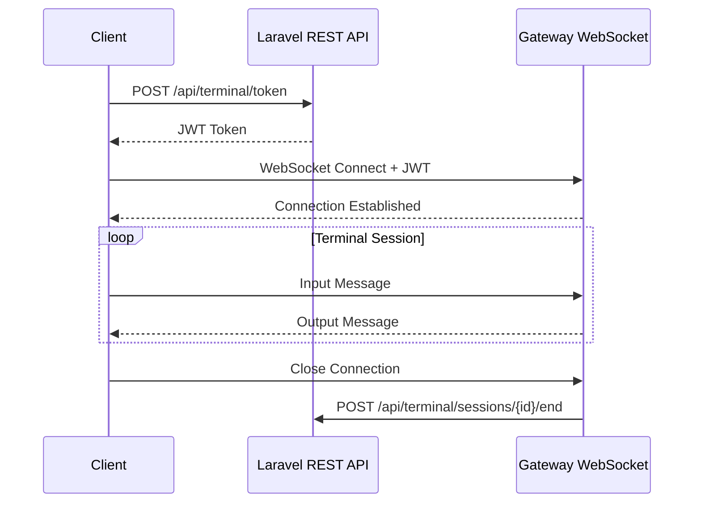

# API Reference

Complete API documentation for Shell Gate, including REST endpoints and WebSocket protocol.

---

## Table of Contents

1. [Overview](#overview)
2. [REST API](#rest-api)
3. [WebSocket Protocol](#websocket-protocol)
4. [Message Types](#message-types)
5. [Error Codes](#error-codes)
6. [Integration Examples](#integration-examples)

---

## Overview

Shell Gate exposes two interfaces:

1. **REST API** — Token generation and session management (Laravel)
2. **WebSocket API** — Real-time terminal communication (Gateway)



---

## REST API

### Base URL

```
https://yourdomain.com/api/terminal
```

### Authentication

All REST endpoints require Filament session authentication (cookie-based) or Sanctum token.

```bash
# Using session cookie
curl -X POST https://yourdomain.com/api/terminal/token \
  -H "Accept: application/json" \
  -H "X-CSRF-TOKEN: {csrf_token}" \
  --cookie "laravel_session={session_cookie}"

# Using Sanctum token
curl -X POST https://yourdomain.com/api/terminal/token \
  -H "Accept: application/json" \
  -H "Authorization: Bearer {sanctum_token}"
```

---

### Endpoints

#### Generate Token

Creates a new terminal session and returns a JWT token for WebSocket authentication.

```
POST /api/terminal/token
```

**Request Headers:**
```
Accept: application/json
Content-Type: application/json
X-CSRF-TOKEN: {csrf_token}
```

**Request Body (optional):**
```json
{
    "cwd": "/var/www/custom-path",
    "cols": 120,
    "rows": 40
}
```

**Response (200 OK):**
```json
{
    "token": "eyJhbGciOiJIUzI1NiIsInR5cCI6IkpXVCJ9...",
    "expires_at": "2026-02-01T15:35:00Z",
    "session_id": "abc123-def456",
    "gateway_url": "wss://yourdomain.com/ws/terminal"
}
```

**Response (401 Unauthorized):**
```json
{
    "message": "Unauthenticated."
}
```

**Response (403 Forbidden):**
```json
{
    "message": "You are not authorized to access the terminal."
}
```

**Response (429 Too Many Requests):**
```json
{
    "message": "Too many token requests. Please try again later.",
    "retry_after": 60
}
```

---

#### Validate Token

Optional endpoint for gateway to validate tokens online.

```
POST /api/terminal/validate
```

**Request Body:**
```json
{
    "token": "eyJhbGciOiJIUzI1NiIsInR5cCI6IkpXVCJ9..."
}
```

**Response (200 OK):**
```json
{
    "valid": true,
    "session_id": "abc123-def456",
    "user_id": 1,
    "user_email": "admin@example.com",
    "cwd": "/var/www/app",
    "expires_at": "2026-02-01T15:35:00Z"
}
```

**Response (401 Invalid Token):**
```json
{
    "valid": false,
    "error": "Token expired"
}
```

---

#### List Active Sessions

Returns all active terminal sessions for the current user.

```
GET /api/terminal/sessions
```

**Response (200 OK):**
```json
{
    "data": [
        {
            "id": "abc123-def456",
            "user_id": 1,
            "started_at": "2026-02-01T15:30:00Z",
            "ip_address": "192.168.1.100",
            "user_agent": "Mozilla/5.0...",
            "status": "active"
        }
    ],
    "meta": {
        "total": 1,
        "max_allowed": 2
    }
}
```

---

#### End Session

Terminates an active terminal session.

```
DELETE /api/terminal/sessions/{session_id}
```

**Response (200 OK):**
```json
{
    "message": "Session terminated successfully."
}
```

**Response (404 Not Found):**
```json
{
    "message": "Session not found or already ended."
}
```

---

#### Session Ended Callback (Gateway → Laravel)

Called by the gateway when a session ends.

```
POST /api/terminal/sessions/{session_id}/end
```

**Request Headers:**
```
X-Gateway-Secret: {shared_secret}
```

**Request Body:**
```json
{
    "ended_at": "2026-02-01T16:00:00Z",
    "reason": "client_disconnect",
    "duration_seconds": 1800
}
```

**Response (200 OK):**
```json
{
    "acknowledged": true
}
```

---

## WebSocket Protocol

### Connection

Connect to the WebSocket gateway with JWT token:

```
wss://yourdomain.com/ws/terminal?token={jwt_token}
```

Or via header:

```javascript
const ws = new WebSocket('wss://yourdomain.com/ws/terminal');
ws.onopen = () => {
    ws.send(JSON.stringify({
        type: 'auth',
        token: jwtToken
    }));
};
```

### Message Format

All messages are UTF-8 encoded. Two formats are supported:

#### Binary Mode (Recommended for Terminal I/O)

Raw bytes sent directly to/from PTY. Used for actual terminal data.

```javascript
// Send keystroke
ws.send('ls -la\r');

// Receive output (binary)
ws.onmessage = (event) => {
    terminal.write(event.data);
};
```

#### JSON Mode (Control Messages)

JSON-encoded messages for control operations.

```javascript
// Resize terminal
ws.send(JSON.stringify({
    type: 'resize',
    cols: 120,
    rows: 40
}));
```

---

## Message Types

### Client → Gateway

#### Input (Binary)

Raw terminal input sent directly as binary/text data.

```javascript
// Simple keystrokes
ws.send('hello');

// Special keys (escape sequences)
ws.send('\x1b[A');  // Arrow Up
ws.send('\x03');    // Ctrl+C
ws.send('\r');      // Enter
```

#### Resize

Notifies the gateway of terminal size change.

```json
{
    "type": "resize",
    "cols": 120,
    "rows": 40
}
```

#### Ping

Keep-alive message.

```json
{
    "type": "ping",
    "timestamp": 1706800000000
}
```

### Gateway → Client

#### Output (Binary)

Raw terminal output sent directly as binary/text data.

```javascript
ws.onmessage = (event) => {
    if (typeof event.data === 'string' && event.data.startsWith('{')) {
        // JSON control message
        const msg = JSON.parse(event.data);
        handleControlMessage(msg);
    } else {
        // Terminal output
        terminal.write(event.data);
    }
};
```

#### Connected

Sent after successful authentication.

```json
{
    "type": "connected",
    "session_id": "abc123-def456",
    "shell": "/bin/bash",
    "cwd": "/var/www/app",
    "user": "www-data"
}
```

#### Pong

Response to ping.

```json
{
    "type": "pong",
    "timestamp": 1706800000000
}
```

#### Error

Error notification.

```json
{
    "type": "error",
    "code": "SESSION_TIMEOUT",
    "message": "Session timed out due to inactivity."
}
```

#### Session Ended

Sent before connection close.

```json
{
    "type": "session_ended",
    "reason": "idle_timeout",
    "duration_seconds": 900
}
```

---

## Error Codes

### WebSocket Close Codes

| Code | Name | Description |
|------|------|-------------|
| 4000 | `GENERIC_ERROR` | Unknown error |
| 4001 | `INVALID_TOKEN` | JWT signature invalid |
| 4002 | `TOKEN_EXPIRED` | JWT has expired |
| 4003 | `IP_MISMATCH` | Client IP doesn't match token |
| 4004 | `INVALID_ORIGIN` | Origin header not allowed |
| 4005 | `SESSION_LIMIT` | Maximum sessions reached |
| 4006 | `SESSION_TIMEOUT` | Session exceeded max duration |
| 4007 | `IDLE_TIMEOUT` | No activity for too long |
| 4008 | `PTY_ERROR` | Failed to spawn PTY |
| 4009 | `UNAUTHORIZED` | User not authorized |
| 4010 | `GATEWAY_SHUTDOWN` | Gateway is shutting down |

### REST API Error Codes

| HTTP Code | Error | Description |
|-----------|-------|-------------|
| 400 | `INVALID_REQUEST` | Malformed request |
| 401 | `UNAUTHENTICATED` | Not logged in |
| 403 | `UNAUTHORIZED` | No terminal access |
| 404 | `NOT_FOUND` | Session not found |
| 429 | `RATE_LIMITED` | Too many requests |
| 500 | `SERVER_ERROR` | Internal error |

---

## Integration Examples

### JavaScript (Browser)

```javascript
class TerminalClient {
    constructor(options = {}) {
        this.options = {
            tokenEndpoint: '/api/terminal/token',
            ...options
        };
        this.ws = null;
        this.terminal = null;
    }
    
    async connect(terminalElement) {
        // 1. Get token from Laravel
        const response = await fetch(this.options.tokenEndpoint, {
            method: 'POST',
            headers: {
                'Accept': 'application/json',
                'Content-Type': 'application/json',
                'X-CSRF-TOKEN': document.querySelector('meta[name="csrf-token"]').content,
            },
            credentials: 'same-origin',
        });
        
        if (!response.ok) {
            throw new Error('Failed to get terminal token');
        }
        
        const { token, gateway_url } = await response.json();
        
        // 2. Initialize xterm.js
        this.terminal = new Terminal({
            cursorBlink: true,
            fontSize: 14,
        });
        this.terminal.open(terminalElement);
        
        // 3. Connect to WebSocket
        this.ws = new WebSocket(`${gateway_url}?token=${token}`);
        
        this.ws.onopen = () => {
            console.log('Terminal connected');
        };
        
        this.ws.onmessage = (event) => {
            if (typeof event.data === 'string' && event.data.startsWith('{')) {
                this.handleControlMessage(JSON.parse(event.data));
            } else {
                this.terminal.write(event.data);
            }
        };
        
        this.ws.onerror = (error) => {
            console.error('WebSocket error:', error);
        };
        
        this.ws.onclose = (event) => {
            console.log(`Connection closed: ${event.code} ${event.reason}`);
            this.terminal.write('\r\n\x1b[31mConnection closed.\x1b[0m\r\n');
        };
        
        // 4. Send input to WebSocket
        this.terminal.onData((data) => {
            if (this.ws.readyState === WebSocket.OPEN) {
                this.ws.send(data);
            }
        });
        
        // 5. Handle resize
        const fitAddon = new FitAddon();
        this.terminal.loadAddon(fitAddon);
        fitAddon.fit();
        
        window.addEventListener('resize', () => {
            fitAddon.fit();
            this.sendResize();
        });
    }
    
    sendResize() {
        if (this.ws.readyState === WebSocket.OPEN) {
            this.ws.send(JSON.stringify({
                type: 'resize',
                cols: this.terminal.cols,
                rows: this.terminal.rows,
            }));
        }
    }
    
    handleControlMessage(msg) {
        switch (msg.type) {
            case 'connected':
                console.log(`Session: ${msg.session_id}`);
                break;
            case 'error':
                console.error(`Error: ${msg.code} - ${msg.message}`);
                break;
            case 'session_ended':
                this.terminal.write(`\r\n\x1b[33mSession ended: ${msg.reason}\x1b[0m\r\n`);
                break;
        }
    }
    
    disconnect() {
        if (this.ws) {
            this.ws.close(1000, 'Client disconnect');
        }
    }
}

// Usage
const client = new TerminalClient();
client.connect(document.getElementById('terminal'));
```

### PHP (Programmatic Token Generation)

```php
use Octadecimal\ShellGate\Services\JwtService;
use Octadecimal\ShellGate\Models\TerminalSession;

class TerminalApiController extends Controller
{
    public function __construct(
        private JwtService $jwtService
    ) {}
    
    public function createSession(Request $request)
    {
        $user = $request->user();
        
        // Create session
        $session = TerminalSession::create([
            'user_id' => $user->id,
            'ip_address' => $request->ip(),
            'user_agent' => $request->userAgent(),
            'started_at' => now(),
        ]);
        
        // Generate token
        $token = $this->jwtService->generate([
            'sub' => $user->id,
            'session_id' => $session->id,
            'cwd' => $request->input('cwd', base_path()),
        ]);
        
        return response()->json([
            'token' => $token,
            'session_id' => $session->id,
            'expires_at' => now()->addSeconds(config('web-terminal.auth.token_ttl')),
        ]);
    }
}
```

### Node.js (Gateway Implementation)

```javascript
const WebSocket = require('ws');
const jwt = require('jsonwebtoken');
const pty = require('node-pty');

const wss = new WebSocket.Server({ port: 7681 });
const sessions = new Map();

wss.on('connection', (ws, req) => {
    const url = new URL(req.url, 'http://localhost');
    const token = url.searchParams.get('token');
    
    // Validate token
    let payload;
    try {
        payload = jwt.verify(token, process.env.JWT_SECRET);
    } catch (err) {
        ws.close(4001, 'Invalid token');
        return;
    }
    
    // Check expiration
    if (Date.now() >= payload.exp * 1000) {
        ws.close(4002, 'Token expired');
        return;
    }
    
    // Spawn PTY
    const shell = pty.spawn(process.env.TERMINAL_SHELL || 'bash', [], {
        name: 'xterm-256color',
        cols: 80,
        rows: 24,
        cwd: payload.cwd || process.cwd(),
        env: process.env,
    });
    
    sessions.set(payload.session_id, { ws, shell, payload });
    
    // Send connected message
    ws.send(JSON.stringify({
        type: 'connected',
        session_id: payload.session_id,
        shell: process.env.TERMINAL_SHELL || 'bash',
        cwd: payload.cwd,
    }));
    
    // PTY output → WebSocket
    shell.onData((data) => {
        if (ws.readyState === WebSocket.OPEN) {
            ws.send(data);
        }
    });
    
    // WebSocket input → PTY
    ws.on('message', (data) => {
        const str = data.toString();
        
        // Check for JSON control messages
        if (str.startsWith('{')) {
            try {
                const msg = JSON.parse(str);
                handleControlMessage(shell, msg);
                return;
            } catch (e) {
                // Not JSON, treat as input
            }
        }
        
        shell.write(str);
    });
    
    // Cleanup on close
    ws.on('close', () => {
        shell.kill();
        sessions.delete(payload.session_id);
        
        // Notify Laravel
        notifySessionEnded(payload.session_id);
    });
});

function handleControlMessage(shell, msg) {
    switch (msg.type) {
        case 'resize':
            shell.resize(msg.cols, msg.rows);
            break;
        case 'ping':
            ws.send(JSON.stringify({ type: 'pong', timestamp: msg.timestamp }));
            break;
    }
}

async function notifySessionEnded(sessionId) {
    try {
        await fetch(`${process.env.LARAVEL_URL}/api/terminal/sessions/${sessionId}/end`, {
            method: 'POST',
            headers: {
                'Content-Type': 'application/json',
                'X-Gateway-Secret': process.env.GATEWAY_SECRET,
            },
            body: JSON.stringify({
                ended_at: new Date().toISOString(),
                reason: 'client_disconnect',
            }),
        });
    } catch (err) {
        console.error('Failed to notify session end:', err);
    }
}

console.log('Terminal Gateway running on port 7681');
```

### cURL Examples

```bash
# Get terminal token
curl -X POST https://yourdomain.com/api/terminal/token \
  -H "Accept: application/json" \
  -H "Authorization: Bearer {your_sanctum_token}"

# List active sessions
curl -X GET https://yourdomain.com/api/terminal/sessions \
  -H "Accept: application/json" \
  -H "Authorization: Bearer {your_sanctum_token}"

# Terminate session
curl -X DELETE https://yourdomain.com/api/terminal/sessions/abc123-def456 \
  -H "Accept: application/json" \
  -H "Authorization: Bearer {your_sanctum_token}"
```

### WebSocket Testing with wscat

```bash
# Install wscat
npm install -g wscat

# Connect with token
wscat -c "wss://yourdomain.com/ws/terminal?token={jwt_token}"

# Once connected, type commands
> ls -la
> pwd
> exit
```

---

## Rate Limits

| Endpoint | Limit |
|----------|-------|
| `POST /api/terminal/token` | 5 per minute per user |
| `GET /api/terminal/sessions` | 30 per minute per user |
| `DELETE /api/terminal/sessions/{id}` | 10 per minute per user |

---

## References

- [WebSocket Protocol RFC 6455](https://tools.ietf.org/html/rfc6455)
- [JWT Specification RFC 7519](https://tools.ietf.org/html/rfc7519)
- [xterm.js API](https://xtermjs.org/docs/api/terminal/classes/terminal/)
- [node-pty API](https://github.com/microsoft/node-pty#api)
