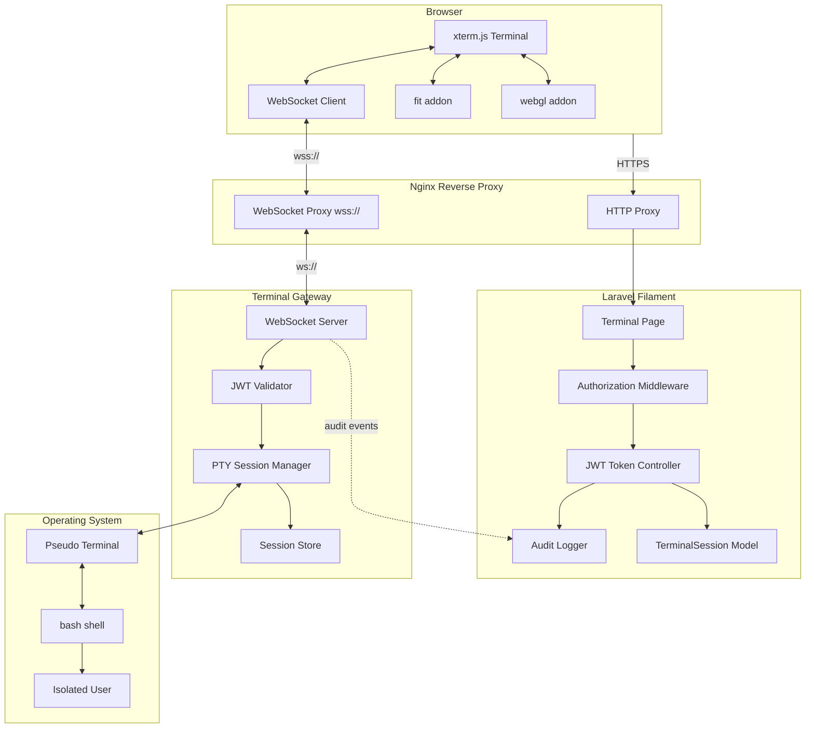
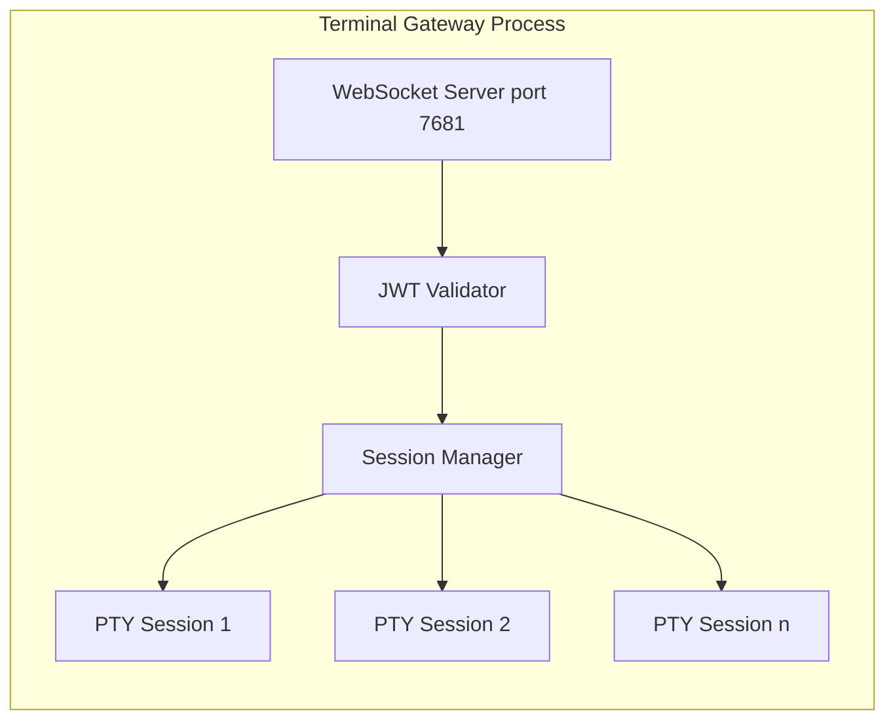
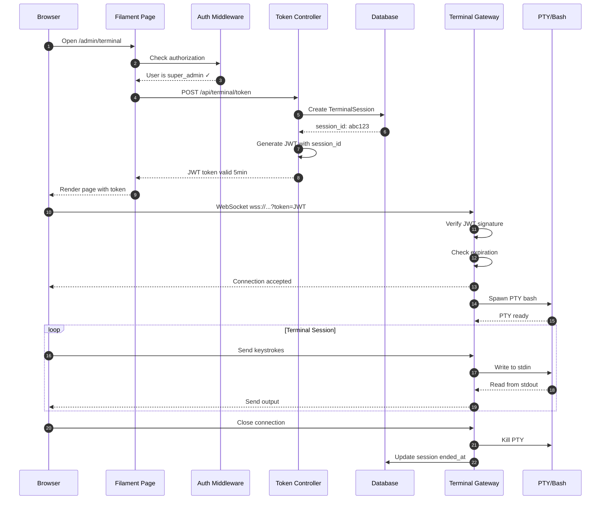
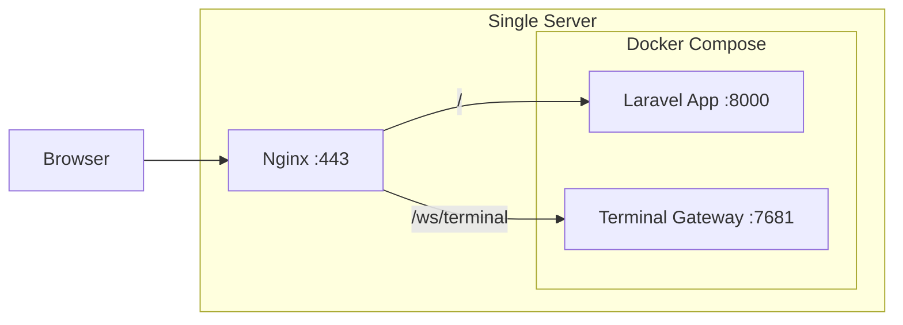
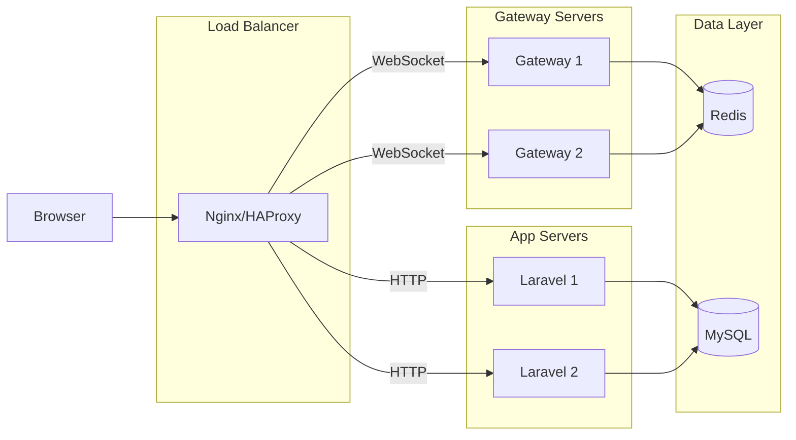

# Architecture

This document describes the system architecture of Shell Gate, including components, data flow, and deployment options.

---

## Table of Contents

1. [High-Level Architecture](#high-level-architecture)
2. [Components](#components)
3. [Authentication Flow](#authentication-flow)
4. [Data Flow](#data-flow)
5. [Plugin Structure](#plugin-structure)
6. [Deployment Options](#deployment-options)
7. [Scaling Considerations](#scaling-considerations)

---

## High-Level Architecture

The plugin consists of three main layers: **Browser** (xterm.js), **Laravel/Filament** (PHP), and **Terminal Gateway** (Node.js/Go).



---

## Components

### 1. Browser Layer

#### xterm.js
The terminal emulator running in the browser. Industry-standard library used by VS Code, JupyterLab, and Portainer.

| Component | Purpose |
|-----------|---------|
| `Terminal` | Core terminal emulator |
| `FitAddon` | Auto-resize terminal to container |
| `WebglAddon` | GPU-accelerated rendering |
| `AttachAddon` | WebSocket stream attachment |

```javascript
// Simplified xterm.js setup
import { Terminal } from '@xterm/xterm';
import { FitAddon } from '@xterm/addon-fit';
import { WebglAddon } from '@xterm/addon-webgl';

const terminal = new Terminal({
    cursorBlink: true,
    fontSize: 14,
    fontFamily: 'Monaco, Menlo, monospace',
    theme: {
        background: '#0d0d0d',
        foreground: '#d4d4d4',
    }
});

const fitAddon = new FitAddon();
terminal.loadAddon(fitAddon);
terminal.loadAddon(new WebglAddon());

terminal.open(document.getElementById('terminal'));
fitAddon.fit();
```

### 2. Laravel/Filament Layer

#### ShellGatePlugin
Main plugin class implementing `Filament\Contracts\Plugin`.

```php
final class ShellGatePlugin implements Plugin
{
    public function getId(): string;
    public function register(Panel $panel): void;
    public function boot(Panel $panel): void;
    
    // Configuration methods
    public function authorize(Closure $callback): static;
    public function navigationGroup(string $group): static;
    public function navigationLabel(string $label): static;
    public function gatewayUrl(string $url): static;
}
```

#### TerminalPage
Filament Page that renders the terminal UI.

```php
class TerminalPage extends Page
{
    protected static string $view = 'shell-gate::terminal-page';
    
    public function mount(): void;
    public function getTerminalToken(): string;
    public function getGatewayUrl(): string;
}
```

#### TerminalTokenController
Issues JWT tokens for WebSocket authentication.

```php
class TerminalTokenController extends Controller
{
    public function __invoke(Request $request): JsonResponse
    {
        // 1. Verify user authorization
        // 2. Create TerminalSession record
        // 3. Generate JWT with session ID
        // 4. Return token (valid 5-10 min)
    }
}
```

#### TerminalSession Model
Tracks active and historical terminal sessions.

```php
class TerminalSession extends Model
{
    protected $fillable = [
        'user_id',
        'session_id',
        'started_at',
        'ended_at',
        'ip_address',
        'user_agent',
    ];
}
```

### 3. Terminal Gateway Layer

The gateway is a separate process (Node.js or Go) that manages PTY sessions.



#### Key Responsibilities
1. **Accept WebSocket connections** with JWT in query string or header
2. **Validate JWT** against Laravel's APP_KEY or via HTTP callback
3. **Spawn PTY process** (bash, zsh, or configured shell)
4. **Bidirectional streaming** — keystrokes to PTY stdin, PTY stdout to WebSocket
5. **Session cleanup** — terminate PTY on disconnect, handle timeouts

#### Node.js Implementation (Simplified)

```javascript
const WebSocket = require('ws');
const pty = require('node-pty');
const jwt = require('jsonwebtoken');

const wss = new WebSocket.Server({ port: 7681 });
const sessions = new Map();

wss.on('connection', (ws, req) => {
    const token = new URL(req.url, 'http://localhost').searchParams.get('token');
    
    try {
        const payload = jwt.verify(token, process.env.JWT_SECRET);
        
        const shell = pty.spawn('bash', [], {
            name: 'xterm-256color',
            cols: 80,
            rows: 24,
            cwd: process.env.TERMINAL_CWD || '/var/www',
            env: process.env,
        });
        
        sessions.set(payload.session_id, { ws, shell });
        
        shell.onData(data => ws.send(data));
        ws.on('message', data => shell.write(data.toString()));
        ws.on('close', () => {
            shell.kill();
            sessions.delete(payload.session_id);
        });
        
    } catch (err) {
        ws.close(4001, 'Invalid token');
    }
});
```

### 4. Operating System Layer

#### PTY (Pseudo Terminal)
A PTY is a pair of virtual devices (master/slave) that provides a terminal interface. The gateway holds the master; the shell (bash) sees the slave as a real terminal.

```
┌─────────────┐     ┌─────────────┐     ┌─────────────┐
│   Gateway   │ ←── │  PTY Master │ ←── │  PTY Slave  │ ←── │    bash    │
│  (node-pty) │ ──→ │             │ ──→ │  /dev/pts/X │ ──→ │   shell    │
└─────────────┘     └─────────────┘     └─────────────┘     └────────────┘
      ↑                                                           │
      │                    stdin/stdout/stderr                    │
      └───────────────────────────────────────────────────────────┘
```

#### User Isolation Options

| Method | Security Level | Complexity | Use Case |
|--------|---------------|------------|----------|
| Same user (www-data) | Low | Simple | Development |
| Dedicated user | Medium | Medium | Small deployments |
| Chroot jail | High | Complex | Shared hosting |
| Docker container | Very High | Medium | Production recommended |

---

## Authentication Flow



---

## Data Flow

### Keystroke Flow (Input)

```
Browser → WebSocket → Gateway → PTY stdin → bash
```

1. User presses key in xterm.js
2. xterm.js sends keystroke via WebSocket
3. Gateway receives binary data
4. Gateway writes to PTY master (stdin)
5. Bash receives character

### Output Flow

```
bash → PTY stdout → Gateway → WebSocket → Browser
```

1. Bash writes output (echo, command result)
2. PTY slave buffers output
3. Gateway reads from PTY master (stdout)
4. Gateway sends via WebSocket
5. xterm.js renders characters

### Special Sequences

| Sequence | Action |
|----------|--------|
| Ctrl+C | SIGINT to foreground process |
| Ctrl+Z | SIGTSTP (suspend) |
| Ctrl+D | EOF (logout if at prompt) |
| Arrow keys | Escape sequences for readline |
| Tab | Completion request |
| Resize | SIGWINCH + new dimensions |

---

## Plugin Structure

```
packages/octadecimalhq/shellgate/
├── composer.json
├── package.json                      # Gateway dependencies
├── LICENSE.md
├── README.md
│
├── config/
│   └── shell-gate.php              # Plugin configuration
│
├── database/
│   └── migrations/
│       └── 2026_01_01_create_terminal_sessions_table.php
│
├── gateway/
│   ├── index.js                      # Node.js gateway entry
│   ├── src/
│   │   ├── server.js                 # WebSocket server
│   │   ├── jwt.js                    # JWT validation
│   │   ├── pty-manager.js            # PTY lifecycle
│   │   └── audit.js                  # Audit logging
│   ├── package.json
│   ├── Dockerfile
│   └── docker-compose.yml
│
├── resources/
│   ├── js/
│   │   └── terminal.js               # xterm.js integration
│   ├── css/
│   │   └── terminal.css              # Terminal styles
│   └── views/
│       ├── terminal-page.blade.php   # Main page view
│       └── components/
│           └── terminal.blade.php    # Terminal component
│
├── src/
│   ├── ShellGatePlugin.php         # Main plugin class
│   ├── WebTerminalServiceProvider.php
│   │
│   ├── Pages/
│   │   └── TerminalPage.php
│   │
│   ├── Http/
│   │   ├── Controllers/
│   │   │   └── TerminalTokenController.php
│   │   └── Middleware/
│   │       └── EnsureTerminalAccess.php
│   │
│   ├── Models/
│   │   └── TerminalSession.php
│   │
│   ├── Services/
│   │   ├── JwtService.php            # JWT generation
│   │   └── AuditService.php          # Session logging
│   │
│   └── Events/
│       ├── TerminalSessionStarted.php
│       └── TerminalSessionEnded.php
│
├── stubs/
│   ├── nginx-websocket.conf          # Nginx config template
│   └── systemd-gateway.service       # Systemd service file
│
└── tests/
    ├── Feature/
    │   ├── TerminalPageTest.php
    │   └── TokenControllerTest.php
    └── Unit/
        └── JwtServiceTest.php
```

---

## Deployment Options

### Option 1: Single Server (Development)



### Option 2: Separate Services (Production)



### Option 3: Kubernetes

```yaml
# Simplified K8s deployment
apiVersion: apps/v1
kind: Deployment
metadata:
  name: shell-gate-gateway
spec:
  replicas: 2
  selector:
    matchLabels:
      app: shell-gate-gateway
  template:
    spec:
      containers:
      - name: gateway
        image: octadecimalhq/shellgate-gateway:latest
        ports:
        - containerPort: 7681
        env:
        - name: JWT_SECRET
          valueFrom:
            secretKeyRef:
              name: app-secrets
              key: app-key
```

---

## Scaling Considerations

### Horizontal Scaling

| Component | Scaling Strategy |
|-----------|------------------|
| Laravel App | Standard horizontal scaling |
| Terminal Gateway | Sticky sessions required |
| PTY Sessions | Bound to specific gateway instance |

### Sticky Sessions

WebSocket connections are stateful. Once connected, the client must continue communicating with the same gateway instance.

```nginx
# Nginx upstream with sticky sessions
upstream terminal_gateway {
    ip_hash;  # or use sticky cookie
    server gateway1:7681;
    server gateway2:7681;
}
```

### Session Limits

Configure maximum concurrent sessions per user and globally:

```php
// config/shell-gate.php
return [
    'limits' => [
        'max_sessions_per_user' => 2,
        'max_total_sessions' => 50,
        'session_timeout' => 3600, // 1 hour
        'idle_timeout' => 900,     // 15 min
    ],
];
```

---

## References

- [xterm.js Documentation](https://xtermjs.org/)
- [node-pty GitHub](https://github.com/microsoft/node-pty)
- [WebSocket RFC 6455](https://tools.ietf.org/html/rfc6455)
- [JWT RFC 7519](https://tools.ietf.org/html/rfc7519)
- [Linux PTY Documentation](https://man7.org/linux/man-pages/man7/pty.7.html)
