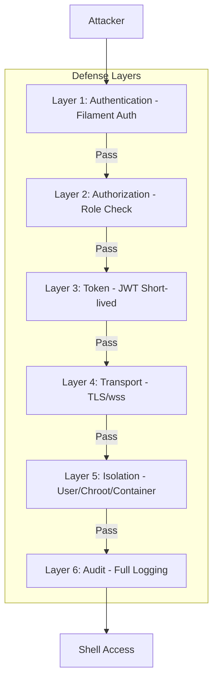
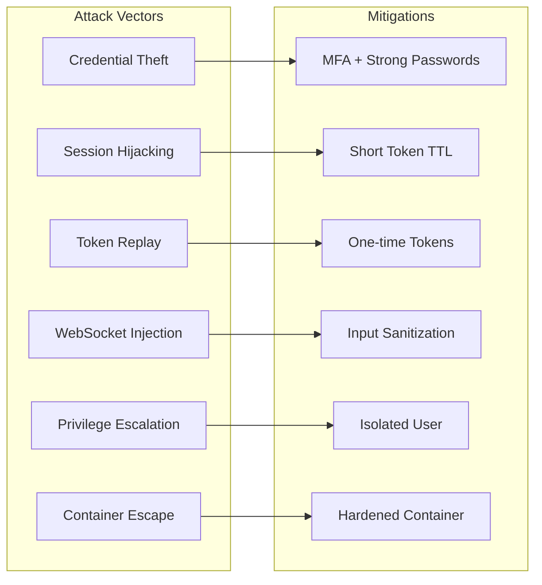
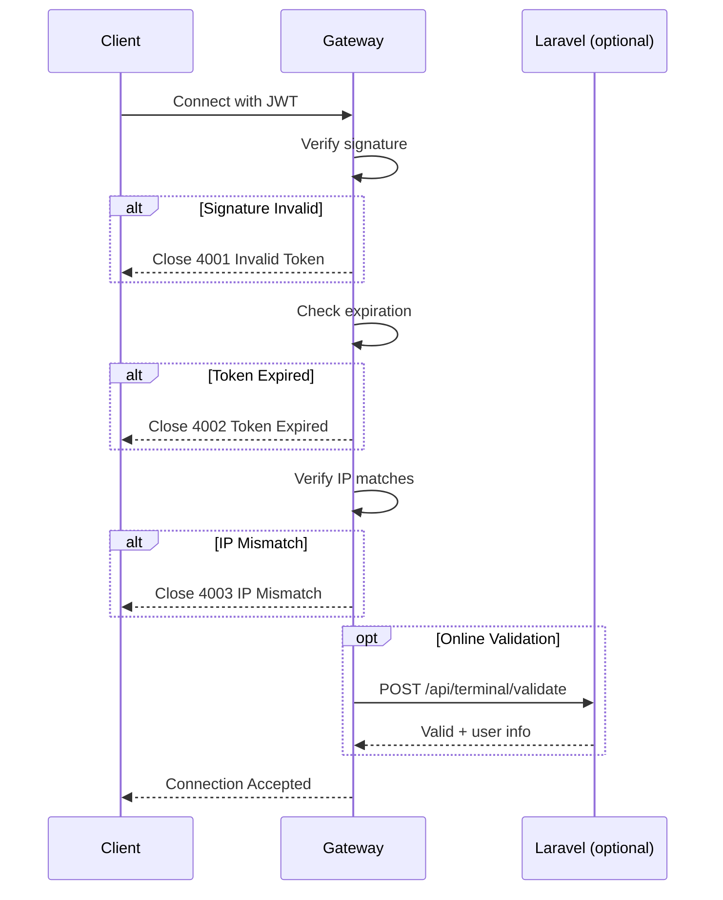
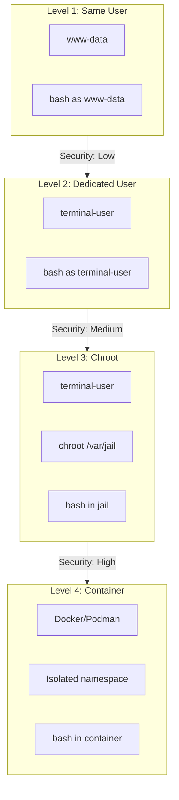
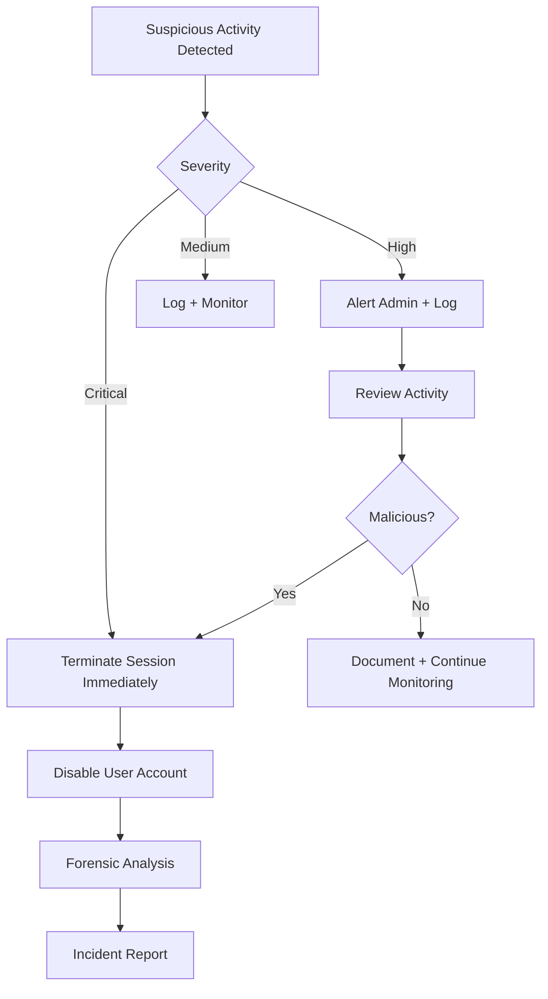

# Security

This document covers the security model, threat analysis, defensive mechanisms, and hardening recommendations for Shell Gate.

---

## Table of Contents

1. [Security Overview](#security-overview)
2. [Threat Model](#threat-model)
3. [Authentication & Authorization](#authentication--authorization)
4. [Transport Security](#transport-security)
5. [User Isolation](#user-isolation)
6. [Audit Logging](#audit-logging)
7. [Rate Limiting](#rate-limiting)
8. [Hardening Checklist](#hardening-checklist)
9. [Incident Response](#incident-response)

---

## Security Overview

Shell Gate provides shell access through a web interface. This is inherently a high-risk feature that requires multiple layers of security.



### Security Principles

1. **Defense in Depth** — Multiple independent security layers
2. **Least Privilege** — Minimal permissions for terminal user
3. **Zero Trust** — Verify every request, even from authenticated users
4. **Fail Secure** — Deny access on any security check failure
5. **Audit Everything** — Log all actions for forensics

---

## Threat Model

### Assets to Protect

| Asset | Value | Impact if Compromised |
|-------|-------|----------------------|
| Server shell access | Critical | Full system compromise |
| Application data | High | Data breach |
| Database credentials | High | Data theft/manipulation |
| Other user sessions | High | Lateral movement |
| System integrity | Critical | Malware installation |

### Threat Actors

| Actor | Motivation | Capability |
|-------|------------|------------|
| External attacker | Data theft, ransomware | High |
| Malicious insider | Sabotage, data theft | Very High |
| Compromised admin account | Lateral movement | Very High |
| Automated bots | Cryptomining, botnet | Medium |

### Attack Vectors



### STRIDE Analysis

| Threat | Category | Mitigation |
|--------|----------|------------|
| Impersonating admin | Spoofing | MFA, strong auth |
| Modifying traffic | Tampering | TLS encryption |
| Denying actions | Repudiation | Comprehensive audit log |
| Accessing unauthorized data | Info Disclosure | User isolation, chroot |
| Crashing gateway | Denial of Service | Rate limiting, resource limits |
| Gaining root | Elevation of Privilege | Non-root user, seccomp |

---

## Authentication & Authorization

### Layer 1: Filament Authentication

Users must be authenticated through Filament's standard authentication system before accessing the terminal.

```php
// Handled by Filament middleware
if (! auth()->check()) {
    return redirect()->route('filament.auth.login');
}
```

### Layer 2: Role-Based Authorization

Terminal access requires explicit authorization via the `->authorize()` callback.

```php
// ShellGatePlugin configuration in AdminPanelProvider.php
use Octadecimal\ShellGate\ShellGatePlugin;

ShellGatePlugin::make()
    ->authorize(function (): bool {
        $user = auth()->user();

        // Option 1: is_super_admin attribute (simplest)
        return $user?->is_super_admin ?? false;

        // Option 2: Spatie roles
        // return $user?->hasRole('super_admin');

        // Option 3: Permission-based
        // return $user?->can('access-terminal');
    });
```

**Important:** If using `is_super_admin`, add boolean cast to User model:

```php
protected function casts(): array
{
    return ['is_super_admin' => 'boolean'];
}
```

### Layer 3: JWT Token

Short-lived JWT tokens authenticate WebSocket connections.

```php
// Token structure
[
    'iss' => 'shell-gate',
    'sub' => $user->id,
    'session_id' => $sessionId,
    'iat' => time(),
    'exp' => time() + 300,  // 5 minutes
    'ip' => request()->ip(),
    'ua_hash' => md5(request()->userAgent()),
]
```

**Token Security Measures:**

| Measure | Implementation |
|---------|---------------|
| Short TTL | 5-10 minutes maximum |
| Single use | Invalidated after connection |
| IP binding | Token bound to client IP |
| User-Agent binding | Hash included in token |
| Secure signature | HS256 with APP_KEY |

### Token Validation Flow



---

## Transport Security

### TLS Configuration

All WebSocket connections MUST use `wss://` (WebSocket Secure).

```nginx
# Nginx SSL configuration
server {
    listen 443 ssl http2;
    
    ssl_certificate /etc/ssl/certs/fullchain.pem;
    ssl_certificate_key /etc/ssl/private/privkey.pem;
    
    # Modern TLS only
    ssl_protocols TLSv1.2 TLSv1.3;
    ssl_ciphers ECDHE-ECDSA-AES128-GCM-SHA256:ECDHE-RSA-AES128-GCM-SHA256;
    ssl_prefer_server_ciphers off;
    
    # HSTS
    add_header Strict-Transport-Security "max-age=63072000" always;
    
    # WebSocket proxy
    location /ws/terminal {
        proxy_pass http://127.0.0.1:7681;
        proxy_http_version 1.1;
        proxy_set_header Upgrade $http_upgrade;
        proxy_set_header Connection "upgrade";
        proxy_set_header X-Real-IP $remote_addr;
        proxy_set_header X-Forwarded-For $proxy_add_x_forwarded_for;
        proxy_set_header X-Forwarded-Proto $scheme;
        
        # Timeouts
        proxy_read_timeout 86400;
        proxy_send_timeout 86400;
    }
}
```

### Origin Validation

Prevent Cross-Site WebSocket Hijacking (CSWSH).

```javascript
// Gateway origin check
const allowedOrigins = process.env.ALLOWED_ORIGINS.split(',');

wss.on('connection', (ws, req) => {
    const origin = req.headers.origin;
    
    if (!allowedOrigins.includes(origin)) {
        ws.close(4004, 'Invalid origin');
        return;
    }
    // ...
});
```

---

## User Isolation

### Isolation Levels



### Level 1: Same User (Development Only)

```javascript
// NOT RECOMMENDED FOR PRODUCTION
const shell = pty.spawn('bash', [], {
    cwd: '/var/www/app',
    env: process.env,
});
```

### Level 2: Dedicated System User

```bash
# Create dedicated user
sudo useradd -r -s /bin/bash -d /home/terminal terminal-user
sudo mkdir -p /home/terminal
sudo chown terminal-user:terminal-user /home/terminal

# Restrict sudo access
echo "terminal-user ALL=(ALL) NOPASSWD: /usr/bin/php, /usr/bin/docker" | sudo tee /etc/sudoers.d/terminal-user
```

```javascript
// Gateway spawns shell as different user
const shell = pty.spawn('sudo', ['-u', 'terminal-user', 'bash'], {
    cwd: '/var/www/app',
});
```

### Level 3: Chroot Jail

```bash
# Create jail structure
sudo mkdir -p /var/jail/{bin,lib,lib64,usr,etc,dev,proc}

# Copy required binaries
sudo cp /bin/bash /var/jail/bin/
sudo cp /bin/ls /var/jail/bin/
# ... copy other needed binaries

# Copy libraries (use ldd to find dependencies)
ldd /bin/bash | grep -o '/lib[^ ]*' | xargs -I {} sudo cp {} /var/jail{}

# Create devices
sudo mknod -m 666 /var/jail/dev/null c 1 3
sudo mknod -m 666 /var/jail/dev/tty c 5 0
sudo mknod -m 666 /var/jail/dev/zero c 1 5
```

```javascript
// Spawn in chroot
const shell = pty.spawn('chroot', ['/var/jail', '/bin/bash'], {
    uid: terminalUserId,
    gid: terminalGroupId,
});
```

### Level 4: Docker Container (Recommended)

```dockerfile
# Dockerfile for isolated terminal
FROM alpine:3.19

RUN apk add --no-cache \
    bash \
    coreutils \
    curl \
    git \
    php83 \
    php83-cli \
    nodejs \
    npm

# Create non-root user
RUN adduser -D -s /bin/bash terminal
USER terminal
WORKDIR /home/terminal

# No capabilities, read-only root filesystem
# Applied at runtime via docker run
```

```javascript
// Spawn container per session
const { exec } = require('child_process');

function spawnTerminalContainer(sessionId) {
    const containerName = `terminal-${sessionId}`;
    
    exec(`docker run -d \
        --name ${containerName} \
        --read-only \
        --cap-drop ALL \
        --security-opt no-new-privileges \
        --memory 256m \
        --cpus 0.5 \
        --network none \
        -v /var/www/app:/app:ro \
        octadecimal/terminal-sandbox \
        tail -f /dev/null
    `);
    
    // Attach to container
    return pty.spawn('docker', ['exec', '-it', containerName, 'bash']);
}
```

### Container Security Options

```yaml
# docker-compose.yml for terminal sandbox
services:
  terminal-sandbox:
    image: octadecimal/terminal-sandbox
    read_only: true
    cap_drop:
      - ALL
    security_opt:
      - no-new-privileges:true
      - seccomp:seccomp-profile.json
    mem_limit: 256m
    cpus: 0.5
    networks:
      - terminal-internal
    tmpfs:
      - /tmp:size=64m,mode=1777
```

---

## Audit Logging

### What to Log

| Event | Data Captured |
|-------|---------------|
| Session start | user_id, ip, user_agent, timestamp |
| Session end | duration, exit_reason |
| Commands | Full command text (optional) |
| Output | Terminal output (optional, high volume) |
| Errors | Authentication failures, connection drops |

### Log Format

```json
{
    "timestamp": "2026-02-01T15:30:45.123Z",
    "event": "session.command",
    "session_id": "abc123",
    "user_id": 1,
    "user_email": "admin@example.com",
    "ip": "192.168.1.100",
    "command": "php artisan migrate",
    "cwd": "/var/www/app"
}
```

### Implementation

```php
// AuditService.php
class AuditService
{
    public function logSessionStart(TerminalSession $session): void
    {
        Log::channel('terminal-audit')->info('Session started', [
            'session_id' => $session->id,
            'user_id' => $session->user_id,
            'ip' => $session->ip_address,
            'user_agent' => $session->user_agent,
        ]);
    }
    
    public function logCommand(string $sessionId, string $command): void
    {
        if (config('shell-gate.audit.log_commands', true)) {
            Log::channel('terminal-audit')->info('Command executed', [
                'session_id' => $sessionId,
                'command' => $this->sanitizeCommand($command),
            ]);
        }
    }
    
    private function sanitizeCommand(string $command): string
    {
        // Redact potential secrets
        return preg_replace(
            '/(password|secret|token|key)=[^\s]+/i',
            '$1=[REDACTED]',
            $command
        );
    }
}
```

### Log Storage

```php
// config/logging.php
'channels' => [
    'terminal-audit' => [
        'driver' => 'daily',
        'path' => storage_path('logs/terminal-audit.log'),
        'level' => 'info',
        'days' => 90,  // Retention period
        'permission' => 0600,
    ],
],
```

---

## Rate Limiting

### Connection Limits

```php
// config/shell-gate.php
'rate_limits' => [
    // Per user
    'max_sessions_per_user' => 2,
    'token_requests_per_minute' => 5,
    
    // Global
    'max_total_sessions' => 50,
    'max_connections_per_ip' => 3,
],
```

### Implementation

```php
// TerminalTokenController.php
public function __invoke(Request $request): JsonResponse
{
    // Rate limit token requests
    $key = 'terminal-token:' . $request->user()->id;
    
    if (RateLimiter::tooManyAttempts($key, 5)) {
        return response()->json([
            'error' => 'Too many requests. Try again later.',
        ], 429);
    }
    
    RateLimiter::hit($key, 60);
    
    // Check concurrent session limit
    $activeSessions = TerminalSession::where('user_id', $request->user()->id)
        ->whereNull('ended_at')
        ->count();
    
    if ($activeSessions >= config('shell-gate.rate_limits.max_sessions_per_user')) {
        return response()->json([
            'error' => 'Maximum concurrent sessions reached.',
        ], 429);
    }
    
    // ... generate token
}
```

---

## Hardening Checklist

### Pre-Deployment

- [ ] **TLS configured** — `wss://` only, TLS 1.2+ minimum
- [ ] **Authorization restricted** — super_admin or specific role only
- [ ] **JWT TTL short** — 5-10 minutes maximum
- [ ] **User isolation** — Dedicated user, chroot, or container
- [ ] **Audit logging enabled** — All sessions and commands logged
- [ ] **Rate limiting configured** — Per-user and global limits
- [ ] **Origin validation** — CORS/origin check enabled
- [ ] **Gateway bound to localhost** — Not exposed directly

### Production Environment

- [ ] **Firewall rules** — Gateway port (7681) not publicly accessible
- [ ] **Resource limits** — Memory and CPU limits on containers
- [ ] **No root** — Gateway and shell run as non-root
- [ ] **Secrets secured** — JWT_SECRET not in code/logs
- [ ] **Log rotation** — Audit logs rotated and archived
- [ ] **Monitoring** — Alerts for suspicious activity

### Ongoing

- [ ] **Regular updates** — Keep dependencies updated
- [ ] **Log review** — Periodic review of audit logs
- [ ] **Access review** — Review who has terminal access
- [ ] **Penetration testing** — Annual security assessment

---

## Incident Response

### Suspicious Activity Indicators

| Indicator | Severity | Response |
|-----------|----------|----------|
| Multiple failed auth | Medium | Temporary lockout |
| Unusual commands (wget, curl to unknown hosts) | High | Alert + review |
| Privilege escalation attempts | Critical | Immediate session termination |
| Unusual hours access | Medium | Alert + verify |
| Bulk file operations | High | Alert + review |

### Response Procedures



### Emergency Shutdown

```bash
# Kill all terminal sessions immediately
docker stop $(docker ps -q --filter "name=terminal-")

# Or for direct PTY
pkill -f "shell-gate-gateway"
```

---

## References

- [OWASP WebSocket Security](https://owasp.org/www-project-web-security-testing-guide/latest/4-Web_Application_Security_Testing/11-Client-side_Testing/10-Testing_WebSockets)
- [JWT Best Practices (RFC 8725)](https://tools.ietf.org/html/rfc8725)
- [Docker Security Best Practices](https://docs.docker.com/engine/security/)
- [Linux Containers Security](https://linuxcontainers.org/lxc/security/)
- [CIS Benchmarks](https://www.cisecurity.org/cis-benchmarks/)
